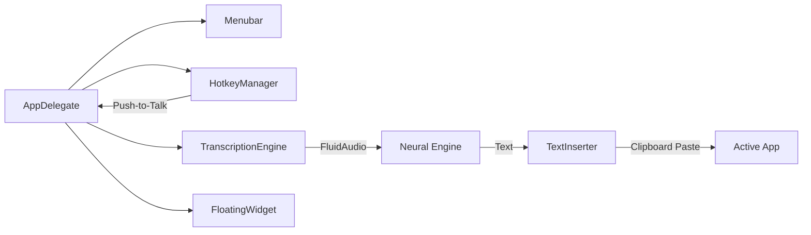

# sshhh 🤫

A native, minimalist macOS menubar application for system-wide speech-to-text. Press a button, speak, and watch your words appear instantly in any application.

## Core Design Decisions

### 🎙️ The Engine: FluidAudio + Parakeet TDT
- **Choice**: Selected **FluidAudio** for its high-performance Swift integration and privacy-first on-device processing.
- **Model**: Uses **NVIDIA Parakeet TDT (v3/v2)**. It was chosen for its incredible speed (up to 190x real-time) and accuracy, specifically optimized for the Apple Neural Engine.
- **Privacy**: All transcription happens locally on your Mac. No audio data ever leaves your device.

### ⌨️ Interaction: Push-to-Talk (Option Key)
- **Hotkey**: The **Option (⌥)** key was selected as the global trigger because it is easily accessible but rarely used as a standalone tapping hotkey in most professional software.
- **Mechanism**: Implemented via a low-level `CGEvent` tap to ensure high-priority global monitoring even when the app is in the background.

### 📝 Integration: Clipboard Simulation
- **Compatibility**: The app uses a "Clipboard Paste" simulation (`Cmd+V`) for text insertion.
- **Why?**: Direct keystroke simulation is often slow and prone to errors in complex apps (like Slack or VS Code). Pasting is instant and handles rich text/formatting context more reliably.
- **Loop Prevention**: The app intelligently pauses its own hotkey listener during insertion to prevent the simulated keystrokes from accidentally re-triggering another recording.

### 🎨 UI: Minimalist & Dynamic
- **Menubar-Only**: Designed as an `LSUIElement` agent app to stay out of the Dock and your way.
- **Morphing Widget**: The floating recording widget is dynamic:
  - **Wide (Idle)**: Shows the brand logo.
  - **Compact (Recording)**: Seamlessly shrinks to a minimal circle with pulsing ring animations to minimize visual distraction.
  - **Borderless**: Designed with a clean, semi-transparent black aesthetic instead of standard system materials to ensure visual consistency across Different macOS versions.

## Build & Distribution

### 🏗️ Build System
- **SPM-First**: Managed via **Swift Package Manager** for clean dependency management of the `FluidAudio` core.
- **Icon Generation**: To maintain a small repo size and ensure high resolution, app icons (1024x1024) are generated programmatically using Core Graphics during the build process.

### 📦 Bundling (bundler.sh)
- **Automation**: A custom bash script handles the heavy lifting:
  - Compiles the project for `arm64` (Apple Silicon).
  - Creates the `.app` bundle structure and `Info.plist`.
  - Signs the app with an ad-hoc signature.
  - Generates a branded **DMG installer** with the app icon applied to both the file and the volume.

## Project Architecture

## Requirements
- **macOS 14+ (Sonoma)**: Required for the latest CoreML/Neural Engine optimizations.
- **Apple Silicon**: Optimized for M1/M2/M3 chips.
- **Permissions**: Requires **Microphone** and **Accessibility** access.

---

*Generated by sshhh 🤫 - Say it, then Sshhh.*
